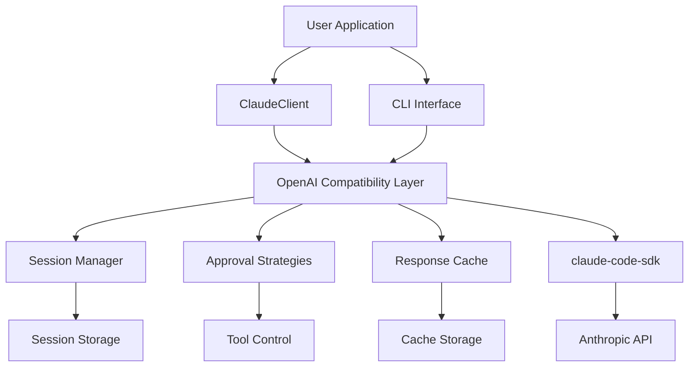
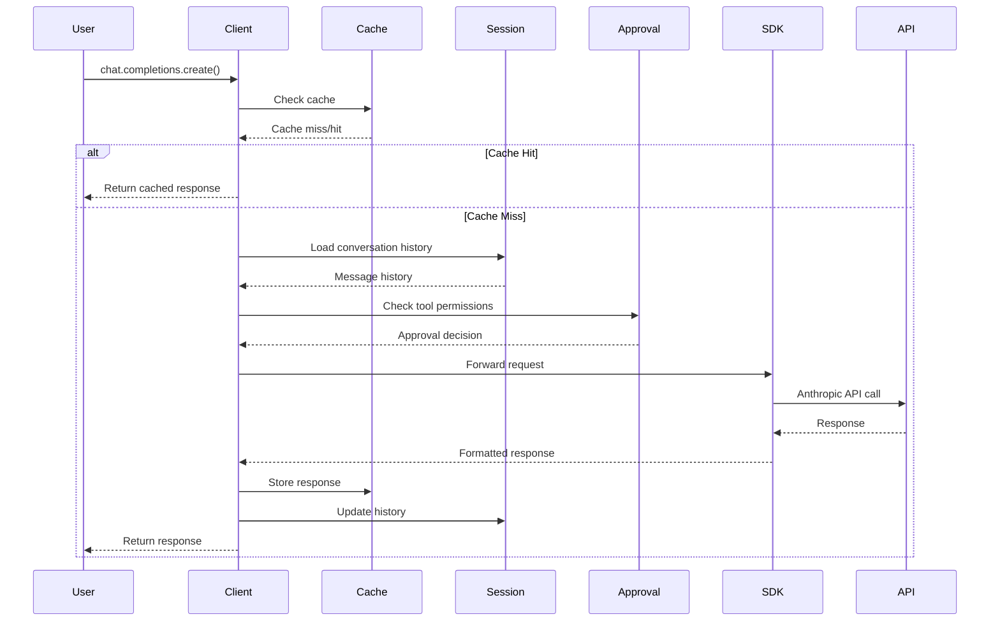

# Chapter 8: Architecture & Internals

This chapter provides a deep dive into claif_cla's architecture, design patterns, and internal implementation details.

## System Architecture

### High-Level Overview



### Component Hierarchy

```
claif_cla/
├── ClaudeClient              # Main API client
├── CLI                       # Command-line interface
├── Session Management        # Conversation persistence
├── Tool Approval            # Security controls
├── Response Caching         # Performance optimization
└── claude-code-sdk          # Underlying SDK
```

## Core Components

### 1. ClaudeClient - Main Interface

**Location:** `src/claif_cla/client.py`

The central component providing OpenAI-compatible access to Claude:

```python
class ClaudeClient:
    """OpenAI-compatible client for Claude AI"""
    
    def __init__(self, api_key=None, timeout=120, **kwargs):
        self.api_key = api_key or os.getenv('ANTHROPIC_API_KEY')
        self.timeout = timeout
        self._claude_client = self._initialize_claude_client()
        self.chat = ChatCompletions(self)
    
    def _initialize_claude_client(self):
        """Initialize underlying claude-code-sdk client"""
        return ClaudeCodeClient(
            api_key=self.api_key,
            timeout=self.timeout
        )
```

**Key Responsibilities:**
- OpenAI API compatibility
- Parameter translation
- Response format conversion
- Error handling standardization

### 2. ChatCompletions - Core API

**Location:** `src/claif_cla/client.py`

Implements the primary chat completions interface:

```python
class ChatCompletions:
    """Chat completions interface compatible with OpenAI"""
    
    def __init__(self, client):
        self.client = client
    
    def create(self, **kwargs) -> ChatCompletion | Iterator[ChatCompletionChunk]:
        """Create chat completion - main entry point"""
        # Parameter validation and translation
        claude_params = self._translate_params(kwargs)
        
        # Execute request through claude-code-sdk
        response = self.client._claude_client.create_completion(claude_params)
        
        # Convert response to OpenAI format
        return self._format_response(response, kwargs.get('stream', False))
```

### 3. Session Manager - Persistence Layer

**Location:** `src/claif_cla/session.py`

Handles conversation persistence and management:

```python
class SessionManager:
    """Manages conversation sessions with atomic operations"""
    
    def __init__(self, session_dir=None):
        self.session_dir = Path(session_dir or self._default_session_dir())
        self.session_dir.mkdir(parents=True, exist_ok=True)
        self._lock = threading.Lock()
    
    def create_session(self, title=None, metadata=None, template=None):
        """Create new session with atomic file operations"""
        with self._lock:
            session_id = self._generate_session_id()
            session = Session(
                id=session_id,
                title=title,
                metadata=metadata or {},
                template=template,
                messages=[],
                created_at=datetime.now(),
                updated_at=datetime.now()
            )
            self._save_session_file(session)
            return session_id
```

**Storage Format:**
- JSON files in `~/.claif/sessions/`
- Atomic write operations
- Concurrent access protection
- Automatic backup/recovery

### 4. Approval Strategies - Security Layer

**Location:** `src/claif_cla/approval.py`

Implements fine-grained tool usage control:

```python
class ApprovalStrategy(ABC):
    """Base class for tool approval strategies"""
    
    @abstractmethod
    def should_approve(self, tool_name: str, tool_metadata: dict) -> bool:
        """Determine if tool usage should be approved"""
        pass
    
    def get_risk_score(self, tool_name: str, tool_metadata: dict) -> int:
        """Calculate risk score (0-10) for tool usage"""
        return 5  # Default medium risk

class CompositeStrategy(ApprovalStrategy):
    """Combine multiple approval strategies"""
    
    def __init__(self, strategies: List[ApprovalStrategy], mode="all"):
        self.strategies = strategies
        self.mode = mode  # "all", "any", "majority"
    
    def should_approve(self, tool_name: str, tool_metadata: dict) -> bool:
        approvals = [
            strategy.should_approve(tool_name, tool_metadata)
            for strategy in self.strategies
        ]
        
        if self.mode == "all":
            return all(approvals)
        elif self.mode == "any":
            return any(approvals)
        elif self.mode == "majority":
            return sum(approvals) > len(approvals) // 2
```

### 5. Response Cache - Performance Layer

**Location:** `src/claif_cla/wrapper.py`

Optimizes API usage through intelligent caching:

```python
class ResponseCache:
    """SHA256-based response caching with TTL support"""
    
    def __init__(self, cache_dir=None, default_ttl=3600):
        self.cache_dir = Path(cache_dir or self._default_cache_dir())
        self.cache_dir.mkdir(parents=True, exist_ok=True)
        self.default_ttl = default_ttl
        self._lock = threading.Lock()
    
    def get_cache_key(self, prompt: str, options: dict) -> str:
        """Generate SHA256 cache key from inputs"""
        # Normalize options for consistent hashing
        normalized_options = self._normalize_options(options)
        cache_input = {
            "prompt": prompt,
            "options": normalized_options
        }
        return hashlib.sha256(
            json.dumps(cache_input, sort_keys=True).encode()
        ).hexdigest()
    
    def get(self, cache_key: str) -> dict | None:
        """Retrieve cached response if valid"""
        with self._lock:
            cache_file = self.cache_dir / f"{cache_key}.json"
            if not cache_file.exists():
                return None
            
            try:
                with open(cache_file, 'r') as f:
                    cached_data = json.load(f)
                
                # Check TTL
                if self._is_expired(cached_data):
                    cache_file.unlink()
                    return None
                
                return cached_data['response']
            except (json.JSONDecodeError, KeyError, FileNotFoundError):
                return None
```

## Data Flow Architecture

### Request Processing Pipeline



### Message Flow

1. **Input Validation**
   - Parameter checking
   - Model availability verification
   - Authentication validation

2. **Context Assembly**
   - Session history retrieval
   - System message injection
   - Context window management

3. **Request Translation**
   - OpenAI → Claude parameter mapping
   - Tool definition conversion
   - Prompt formatting

4. **Execution Control**
   - Tool approval checking
   - Rate limiting
   - Retry logic

5. **Response Processing**
   - Format conversion
   - Error handling
   - Metadata extraction

6. **State Management**
   - Session updates
   - Cache storage
   - Metrics collection

## Design Patterns

### 1. Adapter Pattern

ClaudeClient adapts Claude's API to OpenAI's interface:

```python
class OpenAIAdapter:
    """Adapts Claude API to OpenAI interface"""
    
    def __init__(self, claude_client):
        self.claude_client = claude_client
    
    def translate_request(self, openai_params):
        """Convert OpenAI parameters to Claude format"""
        claude_params = {}
        
        # Direct mappings
        claude_params['model'] = openai_params.get('model')
        claude_params['messages'] = openai_params.get('messages')
        claude_params['temperature'] = openai_params.get('temperature', 0.7)
        
        # Parameter transformations
        if 'max_tokens' in openai_params:
            claude_params['max_tokens_to_sample'] = openai_params['max_tokens']
        
        # Tool calling conversion
        if 'tools' in openai_params:
            claude_params['tools'] = self._convert_tools(openai_params['tools'])
        
        return claude_params
    
    def translate_response(self, claude_response):
        """Convert Claude response to OpenAI format"""
        return ChatCompletion(
            id=claude_response.id,
            object="chat.completion",
            created=claude_response.created,
            model=claude_response.model,
            choices=[
                Choice(
                    index=0,
                    message=Message(
                        role="assistant",
                        content=claude_response.content
                    ),
                    finish_reason=claude_response.stop_reason
                )
            ],
            usage=Usage(
                prompt_tokens=claude_response.usage.input_tokens,
                completion_tokens=claude_response.usage.output_tokens,
                total_tokens=claude_response.usage.input_tokens + claude_response.usage.output_tokens
            )
        )
```

### 2. Strategy Pattern

Tool approval uses interchangeable strategies:

```python
class ToolApprovalContext:
    """Context for tool approval strategy selection"""
    
    def __init__(self, strategy: ApprovalStrategy):
        self.strategy = strategy
    
    def set_strategy(self, strategy: ApprovalStrategy):
        """Change approval strategy at runtime"""
        self.strategy = strategy
    
    def approve_tool(self, tool_name: str, metadata: dict) -> bool:
        """Execute approval using current strategy"""
        return self.strategy.should_approve(tool_name, metadata)

# Usage
context = ToolApprovalContext(AllowListStrategy(["read_file", "search"]))
context.approve_tool("read_file", {})  # True

context.set_strategy(DenyAllStrategy())
context.approve_tool("read_file", {})  # False
```

### 3. Observer Pattern

Session events can be observed for logging/metrics:

```python
class SessionObserver(ABC):
    """Observer interface for session events"""
    
    @abstractmethod
    def on_session_created(self, session: Session):
        pass
    
    @abstractmethod
    def on_message_added(self, session_id: str, message: Message):
        pass

class MetricsObserver(SessionObserver):
    """Collect session metrics"""
    
    def __init__(self):
        self.metrics = defaultdict(int)
    
    def on_session_created(self, session: Session):
        self.metrics['sessions_created'] += 1
    
    def on_message_added(self, session_id: str, message: Message):
        self.metrics['messages_added'] += 1
        self.metrics[f'messages_by_role_{message.role}'] += 1

class SessionManagerWithObservers(SessionManager):
    """Session manager with observer support"""
    
    def __init__(self, *args, **kwargs):
        super().__init__(*args, **kwargs)
        self.observers = []
    
    def add_observer(self, observer: SessionObserver):
        self.observers.append(observer)
    
    def notify_session_created(self, session: Session):
        for observer in self.observers:
            observer.on_session_created(session)
```

### 4. Factory Pattern

Create clients with different configurations:

```python
class ClientFactory:
    """Factory for creating configured clients"""
    
    @staticmethod
    def create_client(client_type: str, **kwargs):
        """Create client with predefined configuration"""
        
        configs = {
            "fast": {
                "model": "claude-3-haiku-20240307",
                "temperature": 0.3,
                "max_tokens": 500
            },
            "smart": {
                "model": "claude-3-opus-20240229",
                "temperature": 0.7,
                "max_tokens": 2000
            },
            "balanced": {
                "model": "claude-3-5-sonnet-20241022",
                "temperature": 0.5,
                "max_tokens": 1000
            }
        }
        
        config = configs.get(client_type, configs["balanced"])
        config.update(kwargs)
        
        return ClaudeClient(**config)

# Usage
fast_client = ClientFactory.create_client("fast")
smart_client = ClientFactory.create_client("smart", temperature=0.9)
```

## Performance Considerations

### 1. Memory Management

```python
class MemoryEfficientSessionManager(SessionManager):
    """Session manager with memory optimization"""
    
    def __init__(self, max_cached_sessions=100):
        super().__init__()
        self.session_cache = {}
        self.max_cached_sessions = max_cached_sessions
        self.access_times = {}
    
    def get_session(self, session_id: str) -> Session:
        """Get session with LRU caching"""
        if session_id in self.session_cache:
            self.access_times[session_id] = time.time()
            return self.session_cache[session_id]
        
        # Load from disk
        session = self._load_session_from_disk(session_id)
        
        # Cache management
        if len(self.session_cache) >= self.max_cached_sessions:
            self._evict_least_recently_used()
        
        self.session_cache[session_id] = session
        self.access_times[session_id] = time.time()
        
        return session
    
    def _evict_least_recently_used(self):
        """Remove least recently used session from cache"""
        lru_session_id = min(self.access_times, key=self.access_times.get)
        del self.session_cache[lru_session_id]
        del self.access_times[lru_session_id]
```

### 2. Concurrent Access

```python
class ThreadSafeCache:
    """Thread-safe response cache implementation"""
    
    def __init__(self):
        self.cache = {}
        self.locks = defaultdict(threading.Lock)
        self.global_lock = threading.Lock()
    
    def get_or_compute(self, cache_key: str, compute_func):
        """Get cached value or compute with per-key locking"""
        
        # Check cache without lock first
        if cache_key in self.cache:
            return self.cache[cache_key]
        
        # Use per-key lock for computation
        with self.locks[cache_key]:
            # Double-check pattern
            if cache_key in self.cache:
                return self.cache[cache_key]
            
            # Compute value
            result = compute_func()
            
            # Store with global lock
            with self.global_lock:
                self.cache[cache_key] = result
            
            return result
```

### 3. Resource Cleanup

```python
class ResourceManager:
    """Manage system resources and cleanup"""
    
    def __init__(self):
        self.temp_files = []
        self.open_connections = []
        atexit.register(self.cleanup)
    
    def cleanup(self):
        """Clean up resources on exit"""
        # Close connections
        for conn in self.open_connections:
            try:
                conn.close()
            except:
                pass
        
        # Remove temp files
        for file_path in self.temp_files:
            try:
                os.unlink(file_path)
            except:
                pass
    
    def register_temp_file(self, file_path: str):
        """Register temporary file for cleanup"""
        self.temp_files.append(file_path)
    
    def register_connection(self, connection):
        """Register connection for cleanup"""
        self.open_connections.append(connection)
```

## Integration Points

### 1. claude-code-sdk Integration

```python
class SDKBridge:
    """Bridge between claif_cla and claude-code-sdk"""
    
    def __init__(self, api_key: str):
        self.sdk_client = ClaudeCodeClient(api_key=api_key)
    
    def translate_and_execute(self, openai_params: dict):
        """Translate OpenAI params and execute via SDK"""
        
        # Parameter translation
        claude_params = self._translate_parameters(openai_params)
        
        # Execute via SDK
        try:
            if openai_params.get('stream', False):
                return self._handle_streaming(claude_params)
            else:
                return self._handle_sync(claude_params)
        except ClaudeAPIError as e:
            # Translate to OpenAI error format
            raise self._translate_error(e)
    
    def _translate_parameters(self, openai_params: dict) -> dict:
        """Convert OpenAI parameters to Claude format"""
        translation_map = {
            'model': 'model',
            'messages': 'messages',
            'temperature': 'temperature',
            'max_tokens': 'max_tokens_to_sample',
            'top_p': 'top_p',
            'stop': 'stop_sequences'
        }
        
        claude_params = {}
        for openai_key, claude_key in translation_map.items():
            if openai_key in openai_params:
                claude_params[claude_key] = openai_params[openai_key]
        
        return claude_params
```

### 2. Plugin Architecture

```python
class PluginManager:
    """Manage claif_cla plugins and extensions"""
    
    def __init__(self):
        self.plugins = {}
        self.hooks = defaultdict(list)
    
    def register_plugin(self, name: str, plugin: 'Plugin'):
        """Register a plugin"""
        self.plugins[name] = plugin
        
        # Register hooks
        for hook_name in plugin.get_hooks():
            self.hooks[hook_name].append(plugin)
    
    def execute_hook(self, hook_name: str, *args, **kwargs):
        """Execute all plugins for a hook"""
        results = []
        for plugin in self.hooks[hook_name]:
            try:
                result = plugin.execute_hook(hook_name, *args, **kwargs)
                results.append(result)
            except Exception as e:
                logger.warning(f"Plugin {plugin.name} hook {hook_name} failed: {e}")
        
        return results

class Plugin(ABC):
    """Base class for claif_cla plugins"""
    
    @property
    @abstractmethod
    def name(self) -> str:
        pass
    
    @abstractmethod
    def get_hooks(self) -> List[str]:
        """Return list of hook names this plugin handles"""
        pass
    
    @abstractmethod
    def execute_hook(self, hook_name: str, *args, **kwargs):
        """Execute hook logic"""
        pass
```

## Testing Architecture

### 1. Mock Infrastructure

```python
class MockClaudeClient:
    """Mock Claude client for testing"""
    
    def __init__(self, responses=None):
        self.responses = responses or {}
        self.call_count = 0
        self.last_params = None
    
    def create_completion(self, params):
        """Mock completion creation"""
        self.call_count += 1
        self.last_params = params
        
        # Return predefined response or generate mock
        key = self._generate_key(params)
        if key in self.responses:
            return self.responses[key]
        else:
            return self._generate_mock_response(params)
    
    def _generate_mock_response(self, params):
        """Generate mock response based on parameters"""
        return MockResponse(
            content=f"Mock response to: {params.get('messages', [])[-1].get('content', '')}",
            model=params.get('model', 'claude-3-5-sonnet-20241022'),
            usage={'input_tokens': 10, 'output_tokens': 20}
        )
```

### 2. Integration Testing

```python
class IntegrationTestSuite:
    """Comprehensive integration testing"""
    
    def __init__(self):
        self.test_client = None
        self.test_session_manager = None
    
    def setup_test_environment(self):
        """Set up isolated test environment"""
        # Create temporary directories
        self.temp_dir = tempfile.mkdtemp()
        
        # Initialize test client
        self.test_client = ClaudeClient(
            api_key="test-key",
            session_dir=os.path.join(self.temp_dir, "sessions"),
            cache_dir=os.path.join(self.temp_dir, "cache")
        )
    
    def test_full_workflow(self):
        """Test complete user workflow"""
        # Create session
        session_id = self.test_client.create_session("Test Session")
        
        # Send message
        response = self.test_client.chat.completions.create(
            model="claude-3-5-sonnet-20241022",
            messages=[{"role": "user", "content": "Hello"}],
            session_id=session_id
        )
        
        # Verify response
        assert response.choices[0].message.content
        
        # Check session persistence
        session = self.test_client.get_session(session_id)
        assert len(session.messages) == 2  # User + Assistant
        
        # Test export
        exported = self.test_client.export_session(session_id, "json")
        assert json.loads(exported)
```

This architecture provides a robust, scalable foundation for the claif_cla system! 🏗️